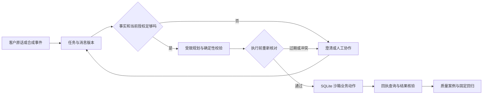

# 衡准：电商售后任务型 Agent 沙箱

衡准是一个可在本机运行的售后工作台原型，聚焦**缺货处置**和**已签收退货**。它把客户当前意愿、订单与库存事实、人工协作、沙箱业务动作及执行回执放在同一条可追踪的任务链里。项目用于验证异常售后流程的产品设计和工程约束，尚未接入真实商家、客户渠道或支付系统。

> **当前状态**：默认规则模式、合成订单、SQLite 持久化、零模型费用。可选的真实模型入口仅处理缺货工单的受限查询路由；退款和换货仍需客户明确确认及服务端规则校验。运营记录是手工编写的模拟数据。

## 为什么做这个项目

售后任务会因事实变化而反复中断：库存可能过期，客户可能改口，仓库签收不代表验收完成，接口超时也不代表动作没有发生。工作台将这些情况表示为任务状态与证据，让每次处理都能回到当前事实、授权和回执。

目标用户假设是有缺货和退换货处理需求的中小电商商家；直接使用者是售后客服、运营和知识维护人员。这个客户画像和收益仍需访谈与真实基线验证。项目目前能证明的是**沙箱流程可以运行并接受回归检查**，不能证明真实商家的自动解决率、节省工时或投资回报。

## 五分钟体验

需要 Python 3.12；默认演示不需要 Node、依赖安装、Codex 账号或模型密钥。

```powershell
git clone https://github.com/yiw27501-creator/hengzhun-support-agent.git
cd hengzhun-support-agent
python start.py
```

Windows 也可双击 `START-WINDOWS.cmd`。其他系统使用 `python3 start.py`。启动后打开 [本机服务台](http://127.0.0.1:8776/service)，保留终端窗口；关闭终端即停止服务。端口占用时使用 `python start.py --port 8780` 并访问对应端口。服务只绑定 `127.0.0.1`，请勿向公网暴露或录入真实客户资料。

建议按下面的顺序演示：

1. 在 `/service` 创建一批六笔合成缺货工单，查看自动完成、待确认及待核实状态。这六类案例是人为均衡配比。
2. 打开“客户改口”工单，查看旧选择失效后的暂停与人工协作；查看商品信息不会触发换货。
3. 打开“身份待核实”工单，依次完成演练中的收件人验证、购买人授权和明确方案选择；这些按钮不代表生产身份认证。
4. 打开“回执查询”工单，观察工具响应丢失后的回执对账，确认订单只产生一次沙箱业务效果。
5. 创建一笔“已签收退货”工单，依次推进方案确认、寄回、仓库签收、验收与退款；验收前不得退款。

其他入口：[模拟运营分析](http://127.0.0.1:8776/operations)、[知识治理](http://127.0.0.1:8776/knowledge)、[质量复盘](http://127.0.0.1:8776/quality) 和 [实验工作台](http://127.0.0.1:8776/lab)。首次启动会导入附带的 100 条模拟运营记录及 5 条待复核标签，重复启动不会重复登记。

## 实际工作流



| 场景 | 当前实现 | 关键边界 |
| --- | --- | --- |
| 缺货换货或退款 | 规则规划、结构化确认、事务内执行和回执 | 库存、付款、身份均为沙箱事实；客户自由文本不自动授权 |
| 客户改口 | 新消息使旧授权失效，版本冲突阻止旧结果覆盖 | 已执行动作不能追溯撤销 |
| 工具响应丢失 | 查询本地执行回执后对账 | 本地单事务不等于外部支付系统的恰好一次语义 |
| 已签收退货 | 方案、寄回、签收、验收、退款的状态链 | 物流和仓库动作是演练按钮，不是真实回调 |
| 模型理解与工具路由 | 可选 DeepSeek 路由，模型只选择受限查询或交互路径 | 默认关闭；未使用供应商原生 Function Calling；不能由模型批准资金动作 |
| 知识与质量运营 | 政策/FAQ 版本治理、失败案例、回测记录 | 无生产多角色权限体系 |

HTTP 服务、规则执行、队列、模型桥接及只读工具网关分别见 [`server.py`](work/agent-backend/server.py)、[`engine.py`](work/agent-backend/engine.py)、[`runtime.py`](work/agent-backend/runtime.py)、[`business_chat.py`](work/agent-backend/business_chat.py) 和 [`tool_gateway.py`](work/agent-backend/tool_gateway.py)。最新业务界面在 [`work/hengzhun-business`](work/hengzhun-business/)；`work/support-agent` 保留仍被本机服务引用的早期静态页面。

## 如何核验

在 `work/agent-backend` 运行：

```powershell
python -m unittest discover -q
python evaluate_workflow_baseline.py
```

第一条运行代码回归测试；第二条按冻结的合成案例通过本机 HTTP 接口和持久化队列检查撤回、非法模型动作、自动执行、超时对账、身份与库存前置条件及退货验收。固定输入在 [`workflow_eval_cases.json`](work/agent-backend/workflow_eval_cases.json)，上次运行结果在 [基线报告](work/agent-backend/evidence/workflow-baseline.json)，判分和解释见 [评测说明](docs/EVALUATION.md)。GitHub Actions 会运行两项检查。

这些数字只表示工程回归是否通过。规则模式和确定性模型替身不能用于报告真实模型准确率；合成案例也不能用于计算商家自动解决率。历史真实模型联调的范围、样本和用量见 [模型桥接说明](work/agent-backend/BUSINESS-MODEL-BRIDGE.md)，本地启动不会重跑付费实验。

## 数据来源与指标口径

| 数据 | 用途 | 能支持的结论 |
| --- | --- | --- |
| 项目编写的合成订单 | 工作台演示与安全回归 | 指定沙箱路径是否按预期运行 |
| 附带的 100 条手工模拟运营记录 | 运营看板与质量案例登记 | 字段解析和指标口径是否正确；**不能**证明真实效果 |
| Bitext 英文混合合成问题，经清洗保留 4,070 条 | FAQ 草稿与意图研究 | 固定来源语料上的处理与实验结果；不代表真实中文售后聊天 |
| 历史真实模型输出 | 小样本联调证据 | 对应实验版本与案例的观察；不代表当前整站全由模型自主操作 |

100 条运营记录编号为 `T20260917011` 至 `T20260917110`，不包含此前讨论过的前 10 条手工示例。看板中的“自动办结”是输入标记，和独立复核的正确办结不同；处理时长的自动组与人工组场景分布不同，不能相减声称节省工时。详见 [运营数据报告](work/agent-backend/OPERATIONS-DATA-REPORT.md)。Bitext 数据来源、修改说明和许可见 [第三方数据说明](THIRD_PARTY_NOTICES.md)。

## 后续验证

下一步使用 [小规模使用测试方案](docs/USER-STUDY.md) 邀请 3–5 位目标售后人员完成同一组任务，记录独立完成、关键误操作和卡点。方案目前**待执行**，仓库没有真实参与者结果。之后才能依据真实问题决定界面和流程的优先级。

若要接真实商家系统，应先做只读订单与库存接口的影子联调：固定服务端身份和地址白名单、把远程等待移出 SQLite 写事务、返回后重新核对消息及授权版本，并为超时与未知结果建立回执查询流程。当前工具契约和未实现边界见 [接入说明](work/agent-backend/TOOL-INTEGRATION.md)。真实退款、可信客户身份、多租户隔离、生产监控与部署均未完成。

## 许可证与使用边界

项目原创代码目前未附加复用许可证。仓库公开可见不等于取得复制、修改或再分发授权。第三方 Bitext 数据适用其自身的 [CDLA-Sharing-1.0 许可](https://cdla.dev/sharing-1-0/)及署名、修改说明。本项目只应使用合成演示数据；不要把本机开发服务器、模拟身份按钮或 SQLite 沙箱用于真实资金操作。
